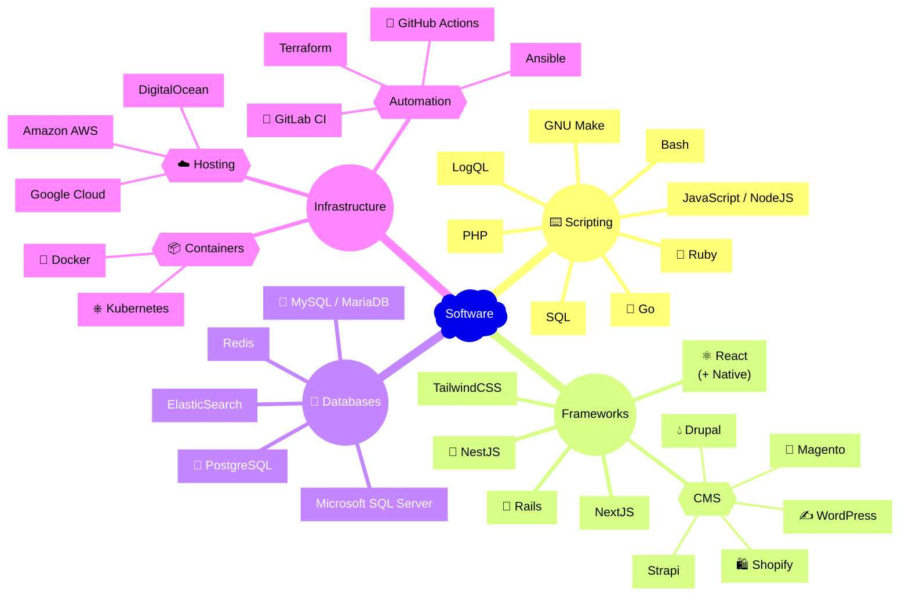

-----

[✉️ Email](mailto:logan@loganstellway.com) • [👨‍💼 LinkedIn](https://linkedin.com/in/lstellway/) • [🖥️ Website](https://loganstellway.com)

-----

### About Me

Software engineer with an emphasis on reliability and usability  
_(including the developer experience - engineers need love too ❤️)_

Experienced with teams from industries in healthcare, automotive finance and retail.

>_Note:_ 
>_I work on many private projects on a self-hosted [Gitea](https://about.gitea.com) instance_ 
>_(GitHub activity does not tell the whole story 😳)_

Feel free to [email me](mailto:logan@loganstellway.com) for a resume or to ask about your project! 
_¡También hablo español, si prefieres!_

Here is some software I work with to give an idea where I may be able to contribute.

<!--
**lstellway/lstellway** is a ✨ _special_ ✨ repository because its `README.md` (this file) appears on your GitHub profile.

Here are some ideas to get you started:

- 🔭 I’m currently working on ...
- 🌱 I’m currently learning ...
- 👯 I’m looking to collaborate on ...
- 🤔 I’m looking for help with ...
- 💬 Ask me about ...
- 📫 How to reach me: ...
- 😄 Pronouns: ...
- ⚡ Fun fact: ...
-->
