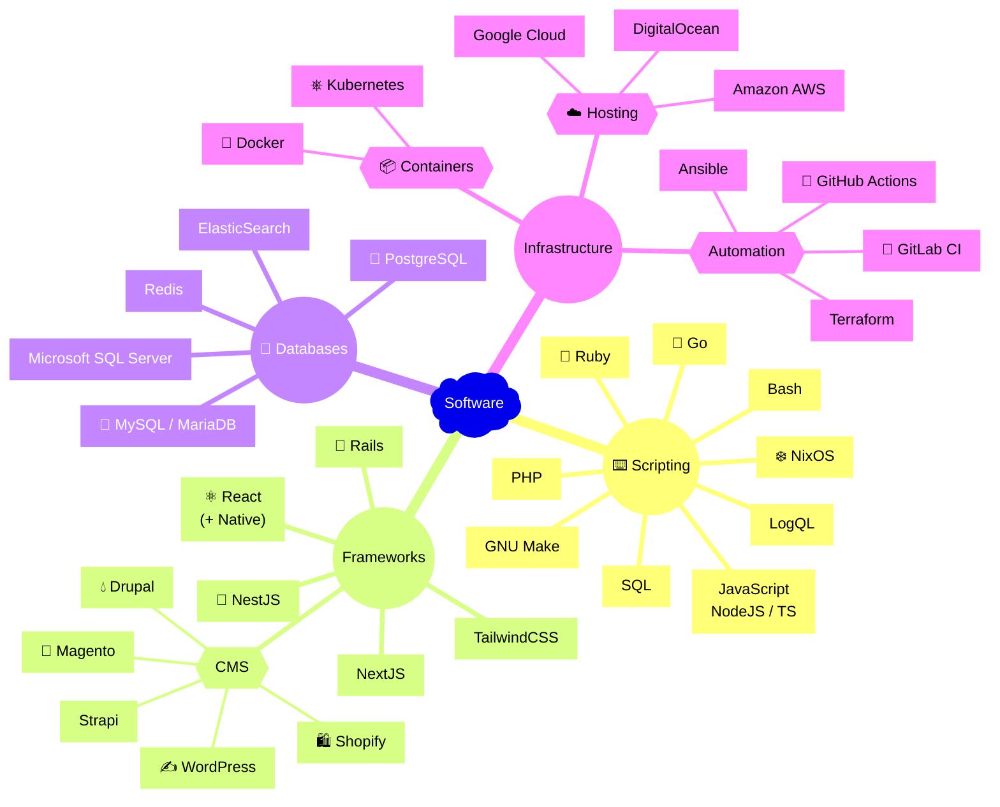

Full-stack software engineer with an emphasis on reliability and usability. 
Experienced with teams from industries in healthcare, automotive finance and retail.

>_I work on many private projects on a self-hosted [Gitea](https://about.gitea.com) instance_ 

Some ways I can contribute:

<!--
**lstellway/lstellway** is a ✨ _special_ ✨ repository because its `README.md` (this file) appears on your GitHub profile.

Here are some ideas to get you started:

- 🔭 I’m currently working on ...
- 🌱 I’m currently learning ...
- 👯 I’m looking to collaborate on ...
- 🤔 I’m looking for help with ...
- 💬 Ask me about ...
- 📫 How to reach me: ...
- 😄 Pronouns: ...
- ⚡ Fun fact: ...
-->
