### Hello 👋

My name is Logan and I’m a software engineer who is a teacher at heart, striving to grow myself and the people around me. I have experience with a variety of teams in industries including healthcare, automotive finance and retail. I am experienced with mobile and web application development, backend API’s + services, infrastructure, container orchestration and automation. I am a quick learner and enjoy tailoring technology to unique business needs.

[Email](mailto:logan@loganstellway.com) | [LinkedIn](https://linkedin.com/in/lstellway/)

#### Technology

At times, working with software is like being a construction worker. 
Other times, it is like being a composer: pulling all the right pieces together to create a masterpiece. 

Here are some technologies I work with _(not all-inclusive)_ to give you an idea where I may be able to contribute. 
Feel free to [email me](mailto:logan@loganstellway.com) for a resume or to ask about your project! 

_¡También hablo español, si prefieres!_

```mermaid
mindmap
  root)Software(
    script((⌨️ Scripting))
      [🦫 Go]
      [💎 Ruby]
      [Bash]
      [PHP]
      [GNU Make]
      [SQL]
      [LogQL]
      ["JavaScript / NodeJS"]
    ((Frameworks))
      [NextJS]
      [TailwindCSS]
      [NestJS]
      [🚊 Rails]
      ["⚛️ React<br />(+ Native)"]
      {{CMS}}
        [✍️ WordPress]
        [🛒 Magento]
        [Strapi]
        [Drupal]
        [Shopify]
    ((💾 Databases))
      [MySQL / MariaDB]
      [PostgreSQL]
      [Microsoft SQL Server]
      [Redis]
      [ElasticSearch]
    ((Infrastructure))
      {{📦 Containers}}
        [🐳 Docker]
        [⎈ Kubernetes]
      {{Hosting}}
        [DigitalOcean]
        [Google Cloud]
        [Amazon AWS]
      {{Automation}}
        [GitHub Actions]
        [GitLab CI]
        [Terraform]
        [Ansible]
```

<!--
**lstellway/lstellway** is a ✨ _special_ ✨ repository because its `README.md` (this file) appears on your GitHub profile.

Here are some ideas to get you started:

- 🔭 I’m currently working on ...
- 🌱 I’m currently learning ...
- 👯 I’m looking to collaborate on ...
- 🤔 I’m looking for help with ...
- 💬 Ask me about ...
- 📫 How to reach me: ...
- 😄 Pronouns: ...
- ⚡ Fun fact: ...
-->
